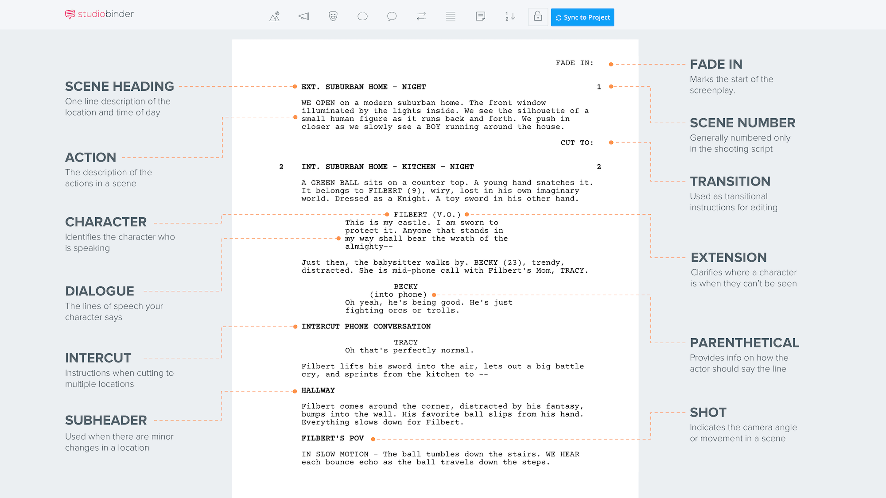
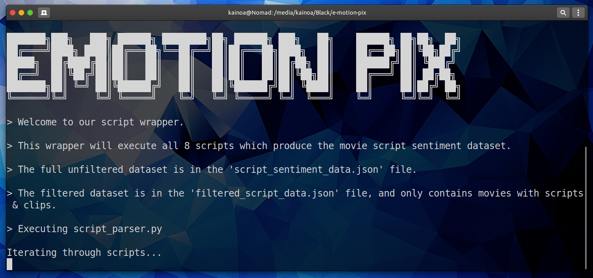
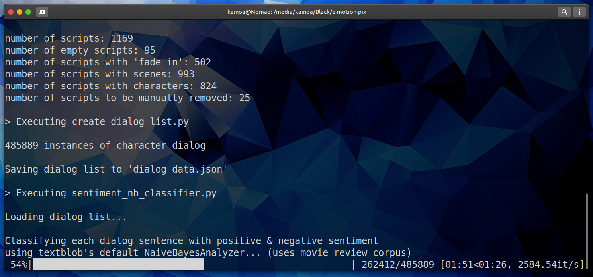
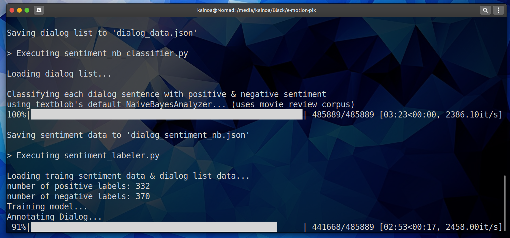
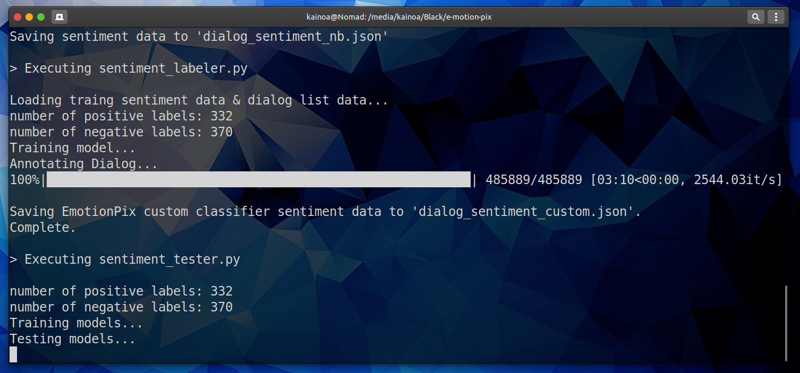
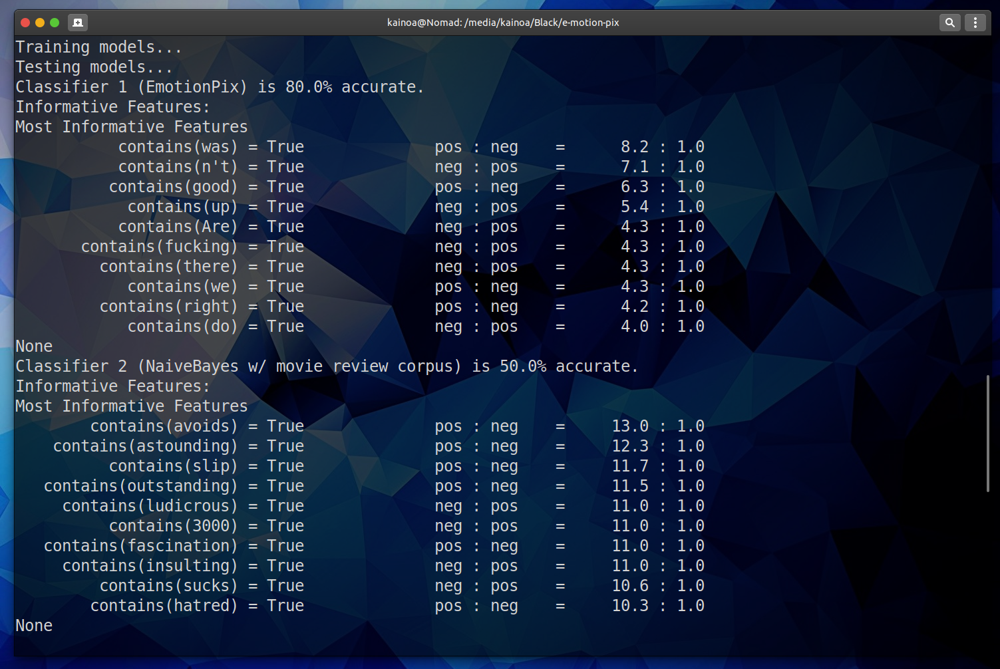
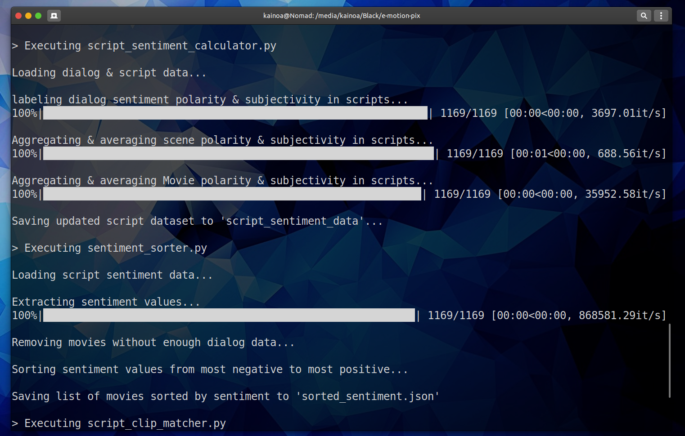
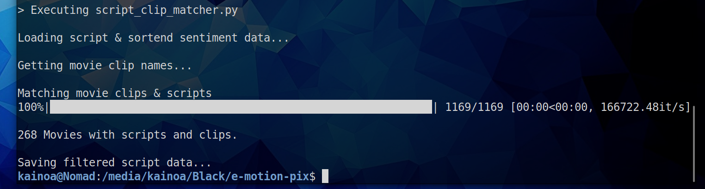

# CMPT419 Special Topics in AI: Affective Computing -- Movie Script Sentiment Analysis

This project was completed during the "Special Topics in Artificial Intelligence: Affective Computing" course taken at SFU http://www.sfu.ca/outlines.html?2020/summer/cmpt/419/d100

### Inspiration

The movie script sentiment analysis project was a part of a final course project in which
students were given creative liberty in developing their own project. 

I was inspired on developing this project after thinking about different modalities intelligent
agents can extract emotion information from. For example, humans (and animals) learn about
other humans (and animals) by reading body language, infering facial expressions and such. And 
we can teach computers (intelligent agents) to do the same. One issue was raised in class, that in some scenarios, people may show one facial expression/body language type but be feeling something
completely different. The issue being, visual stimulus may get it wrong sometimes. 

So while we can have an intelligent agent watch movies, youtube videos and such to train it, 
We cannot teach an agent to be a mind reader. However when we read books, often we get insight into
the mind of the characters through some form of naration. Enter the movie script; from movie scripts, we can extract useful information such as dialog sentiment, actions, and character behaviours. In addition, movie scripts have a strict formatting style to parse important information (seen below).

### Movie Script Data Extraction Scripts

In this project, useful scene information is extracted by python scripts, formatted into a
json file. Character dialog is compiled and used to train a machine learning model to infer
sentiment in conversations. 

parser output & generated data is already included in this repo on a sample of 22 movie scripts,
but analysis on the entire 1169 movie script library can be run using:

`python3 -m pip install -r python/requirements.txt`
`pip install -U textblob`
`python3 -m textblob.download_corpora # to unstall dependencies`
`python/run-scripts`

* takes about 12.5 minutes to complete.

### Details

There are 10 python scrips having different functions for movie script data, but all (except sentiment_tester.py can be executed with the ./python/run-scripts bash script. Running this script will create our movie script sentiment datasets, final datasets being called script_sentiment_data.json & filtered_script_data.json. 

The former dataset contains all 1169 movie script data, and the latter contains the dataset of 286 movie data having script, clips, and sentiment data. 

sentiment_tester.py runs an automated sentence sentiment labeler, pressing 1 to annotate a sentence as positive, and pressing 2 to annotate a sentence as negative. The script creates a test file, and does not actually append new data to our current training labels.

script_parser.py extracts all possible information from all movie scripts create_dialog_list.py extracts dialog from json data, and creates a list, making other scripts run more efficiently. 

sentiment_nb_classifier.py creates a dataset of sentiment labels using the movie review corpus. To be reviewed with our classifier later. sentiment_labler.py uses our training set of labels to label dialog (just like sentiment_nb_cdlassifier does) sentiment_tester.py automated script to label dialog with sentiment efficiently script_sentiment_calculator.py takes script json data and appends new dialog sentiment labels to it sentiment_sorter.py takes sentiment labels and sorts from most negative dialog to most positive dialog script_clip_matcher.py filters json data and sorted sentiment labels to inslucde only movies with scripts and clips

### Parser script output

